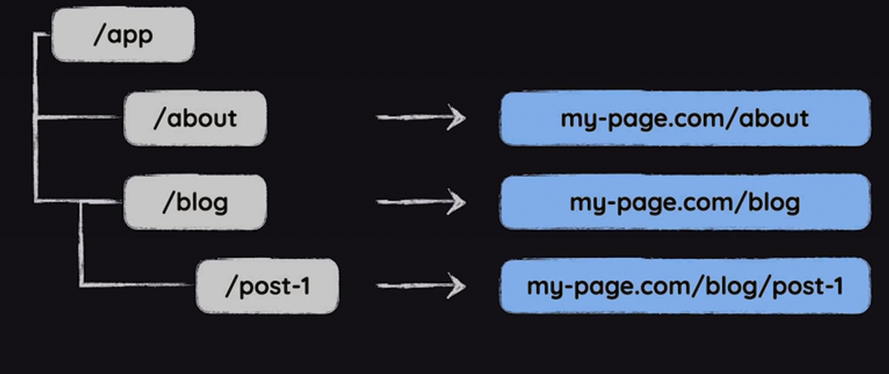

# Next.js 14 & React

## Nawigacja

Żeby dodać nową stronę wystarczy stworzyć folder w `/app` directory np `/app/about` z plikiem `/app/about/page.js`



page jest server componentem, np. console.log() nie dziala w przegladarce bo wszystko dzieje sie po stronie serwera

nie używamy anchorów kiedy dajemy linka do miejsca, ktore znajduje sie na naszej stronie, to powoduje ze strona jest przeładowywana i pobierana z serwera

dlatego importujemy i uzywamy `Link` 

```jsx
import Link from "next/link"

<Link href="/about">About Us</Link>
```

## Layout

```jsx
import './globals.css'

export const metadata = {
  title: 'NextJS Course App',
  description: 'Your first NextJS app!',
};

export default function RootLayout({ children }) {
  return (
    <html lang="en">
      <body>{children}</body>
    </html>
  );
}

```


## Dynamic Route


`[slug]` to placeholder folder ktory wskazuje na to ze chcemy miec jakis path po `blog/` ale nie znamy dokladnej wartosci

w `page.js` pod blog mozemy:

```jsx
export default function BlogPage(){
  return(
	  <main>
	    <h1>The Blog</h1>
	    <p><Link href="/blog/post-1">Post 1</Link></p>
	    <p><Link href="/blog/post-2">Post 2</Link></p>
	  </main>
  )
```

wtedy po klikneciu w link otwiera sie path `/blog/post-X` który korzysta z `page.js`  w `[slug]`

## Server-side komponenty

Domyślnie wszystkie komponenty, które tworzymy w projekcie nextjs są renderowane tylko na serwerze


## Database

warto stworzyć oddzielny folder `lib`  dla operacji związanych z bazą danych

```jsx
import sql from "better-sqlite3"

const db = sql("meals.db")

export function getMeals(){
  // . all() dla fetching data
  // .run() dla zmieniania date
  return db.prepare("SELECT * FROM meals").all()
}
```

## Loading

Niech `MealsPage`  będzie stroną wyświetlającą przepisy

```jsx
export default function MealsPage() {
  return (
    <>
      <main className={classes.main}>
				// PRZEPISY
      </main>
    </>
  );
}
```

Żeby wyświetlić przepisy możemy wyżej zdefiniować asynchroniczną funkcje `Meals` , która fetchuje przepisy i zwraca komponent odpowiedzialny za wyświetlanie przepisów razem z podanymi propsami

```jsx
async function Meals() {
  const meals = await getMeals();
  return <MealsGrid meals={meals} />;
}
```

Teraz wystarczy użyć `Suspense` i zwrapować nim asynchroniczny komponent. Suspense będzie wyświetlało zdefinowany `fallback`  aż do momentu rozwiązania asynchronicznego promisu

```jsx

export default function MealsPage() {
  return (
    <>
      <main className={classes.main}>
        <Suspense
          fallback={<p className={classes.loading}>Fetching meals..</p>}
        >
          <Meals />
        </Suspense>
      </main>
    </>
  );
}

```

### loading.js

Żeby pokazać użytkownikowi loading state wystarczy stworzyć plik `loading.js` na tym samym poziomie co `page.js` lub wyżej. Nextjs automatycznie szuka takiego pliku i pokazuje content w nim zawarty kiedy asynchroniczna funkcja czeka na rozwiązanie promisa

## Form submission / Server actions

dla forma tworzymy server side funkcję, która będzie przyjmowała `formData` i zostanie wykonana przy wysyłaniu formsa

Dodajemy do form `action={nazwaFunkcji}` ktory odpali wcześniej zdefiniowaną funkcję działająca na serwerze

```jsx
  // tworzymy server action ktora bedzie wykonana tylko na serwerze
  async function shareMeal(formData)
    // server action musi byc async
    "use server";
    const meal = {
    };
    
    <form action={shareMeal}>
    </form>
  
```

Taka funkcja raczej będzie znajdowała się w oddzielnym pliku np w folderze `lib/actions.js` 

```jsx
"use server";
  // tworzymy server action ktora bedzie wykonana tylko na serwerze
  export async function shareMeal(formData) {
    // server action musi byc async
    const meal = {
      title: formData.get("title"),
      summary: formData.get("summary"),
      instructions: formData.get("instructions"),
      image: formData.get("image"),
      creator: formData.get("name"),
      email: formData.get("email")
    };

    console.log(meal)
  }
```

## useFormState()

Ten hook jest odpowiedzialny za zarządzanie statem komponentu, który używa form submitowanego razem z uruchomieniem server action.

Pierwszy argument to funkcja server action, która zostanie ztriggerowana kiedy form będzie submitted. Drugi argument to initial state tego komponentu np. `null` albo `{message:  null}` .

Kiedy server action funkcja będzie zwracała jakąś wiadomość to zostanie przechwycona przez `useFormState()`

```jsx
const [formState, formAction] = useFormState(shareMeal, {message: null});
```

Teraz `action={}` w form będzie `formAction` dostarczane przez hook

```jsx
  <form action={formAction}>
  </form>
```

Teraz server action `shareMeal` będzie przyjmować dwa argumenty: `prevState` i `formData` 

```jsx
export async function shareMeal(prevState, formData) {}
```

Możemy użyć state np. żeby pokazać użytkownikowi jakąś wiadomość zwracaną przez akcje

```jsx
{state.message && <p>{message}</p>}
```

## Parallel Routes

pozwala na renderowanie różnych od siebie ścieżek na tej samej stornie


tutaj nową ścieżką, stroną jest `/archive` 

za pomocą `@` tworzymy równoległe ścieżki

zawartość pliku `layout.js`

tutaj możemy odbierać propy z nazwami wcześniej stworzonych parallel routes `@parrarel_route`

```jsx
export default function ArchiveLayout({ archive, latest }) {
  return (
    <div>
      <h1>News Archive</h1>
      <section id="archive-filter">{archive}</section>
      <section id="archive-latest">{latest}</section>
    </div>
  );
}
```

## Catch-all routes

catch all route tworzymy  `[[...nazwa]]`

sprawia, że `page.js`  w środku ścieżki typu catch-all będzie aktywny po każdym segmencie ścieżki po ścieżce rodzic


tutaj każda ścieżka po `/archive` 
czyli `/archive/SCIEZKA/`  ,  `/archive/SCIEZKA/` itd

`{params}` w funkcji teraz zwraca array, którego elementy to nazwy kolejnych ścieżek `/archive/ELEMENT_1/ELEMENT_2`

## Intercepting Route

Dla tej samej ścieżki pokazywany jest inny wynik w zależności w jaki sposób użytkownik dostał się do tej ścieżki

Tworzymy folder przy pomocy `(PATH)NAZWA`  jeżeli ścieżka, ktorą chcemy przechwycić jest w sibling folderze to wystarczy wpisać kropkę i nazwę ścieżki do przechwycenia np. `(.)images`


## Route group

nowy folder `(NAZWA)` tworzy route grupe

## Route handler

zazwyczaj tworzy się folder `api` na poziomie route grup, w środku plik `route.js` ,  jest to kolejna zarezerwowana nazwa, którą szuka nextjs

```jsx
export function GET(request) {
  return new Response("Hello!")
}
```

## Middleware

middleware tworzymy na poziomie ponad app, `middleware.js` to zarezerwowana nazwa pliku, która szuka funkcji `middleware()` 

```jsx
import { NextResponse } from "next/server";

export function middleware(request){
  return NextResponse.redirect()
}
```

Middleware sprawdza nadchodzące zapytanie i może je zmodyfikować, zablokować, przeadresować

## Data fetching

Server components pozwalają na asynchroniczne zdefiniowanie funkcji, komponenty mogą zwracać promisy, client side tego nie potrafi.

Komponent asynchroniczny będzie działał na promisach

```jsx
export default async function NewsPage() {
  const response = await fetch("http://localhost:8080/news");

  if (!response.ok) {
    throw new Error("failed to fetch news.");
  }

  const news = await response.json();

  // nie trzeba definiowac newsContent bo mamy do czynienia z asynchronicznym komponentem
  // jeśli response jest ok to ten backend zawsze zwróci array, nie trzeba martwić się że jsx NewsList będzie pusty
  return (
    <>
      <h1>News Page</h1>
      <NewsList news={news} />
    </>
  );
}
```

### Data fetching z wewnętrznej bazy danych

Mając baze danych na serwerze np. plik `data.db` w root directory projektu jesteśmy w stanie pominąć wysyłanie zapytania api i dostać dane bezpośrednio z bazy danych

Prosta funkcja znajdująca się w `lib/news.js` , pozwala na komunikację z bazą danych

```jsx
import sql from "better-sqlite3";
const db = sql("data.db");

export function getAllNews() {
  const news = db.prepare("SELECT * FROM news").all();
  return news;
}
```

Taką funkcję wystarczy użyć w komponencie

```jsx
import { getAllNews } from "@/lib/news";

export default function NewsPage() {
  const news = getAllNews();
  return (
    <>
      <h1>News Page</h1>
      <NewsList news={news} />
    </>
  );
}
```

## useFormStatus()

ten hook zwraca obiekt status, który zawiera różne informacje o statusie forma, wewnątrz którego znajduje się ten hook. Musi on zawierać się między form tagami

```jsx
"use client";
import { useFormStatus } from "react-dom";

export default function FormSubmit() {
  const status = useFormStatus();

  if (status.pending) {
    return <p>Creating post...</p>;
  }

  return (
    <>
      <button type="reset">Reset</button>
      <button>Create Post</button>
    </>
  );
}

```

## Optimistic update

useOptimistic to hook, który przyjmuje dwa argumenty, 
- pierwszy to data np. posts array, który fetchujemy z bazy danych
- drugi to funkcja, która zmienia posts array po stronie klienta dopók nie zostanie przetworzona na serwerze

hook zwraca array, który jest optymistycznie przetworzony i funkcję, która triggeruje zmiane

```jsx
  const [optimisticPosts, updateOptimisticPosts] = useOptimistic(
    posts,
    (prevPosts, updatedPostId) => {
      const updatedPostIndex = prevPosts.findIndex(
        (post) => post.id === updatedPostId
      );
      if (updatedPostIndex === -1) {
        return prevPosts;
      }
      const updatedPost = { ...prevPosts[updatedPostIndex] };
      updatedPost.likes = updatedPost.likes + (updatedPost.isLiked ? -1 : +1);
      updatedPost.isLiked = !updatedPost.isLiked;
      const newPosts = [...prevPosts];
      newPosts[updatedPostIndex] = updatedPost;
      return newPosts;
    }
  );
```

## Caching


### revalidatePath()

revalidatePath jest super rozwiązaniem bo można zdecydować dokładnie w którym momencie ma nastąpić rewalidacja. Jeśli wiemy kiedy zmieni się data to używamy revalidatePath

revalidatePath mówi nextjs żeby rewalidować cache, który należy do ścieżki `/meals` . Czyli usuwamy cache, który jest skojarzony z tymi stronami

```jsx
revalidatePath("/meals")
```

Jeśli dodamy jako drugi argument `"layout"` , to wszystkie nested pages na tej ścieżce zostaną zrewalidowane

```jsx
revalidatePath("/meals", "layout")
```

### revalidateTag()

wcześniej ustawiamy tag w konfiguracji zapytania

```jsx
  const response = await fetch('http://localhost:8080/messages', {
		next: {
			next: {tags: ["tag1", "tag2"]}
		}
  });
```

potem uruchamiamy funkcję tam gdzie chcemy rewalidować

```jsx
revalidateTag("tag2")
```

### Deduplikacja zapytań do bazy danych

wrapujemy funkcją `cache` 

```jsx
import { cache } from "react";

export const getMessages = cache(function getMessages() {
  console.log("Fetching messages from db");
  return db.prepare("SELECT * FROM messages").all();
});
```

### Cache dla niestandardowych źródeł danych

`unstable_cache()` zwraca promisa, drugi argument funkcji to cache keys, trzeci argument to obiekt konfiguracji

```jsx
import { cache } from "react";
import { unstable_cache } from "next/cache";

export const getMessages = unstable_cache(
  cache(function getMessages() {
    console.log("Fetching messages from db");
    return db.prepare("SELECT * FROM messages").all();
  }),
  ["messages"], {
    tags: ["msg"]
  }
);

```

### Inne sposoby

Możemy dodać obiekt konfiguracji do zapytania i ustawić opcje cache, tutaj cache nie będzie zapisywany i dane będą rewalidowane

```jsx
  const response = await fetch('http://localhost:8080/messages', {
		cache: "no-store",
  });
```

W projekcie nextjs zamiast opcji cache możemy skonfigurować opcje next

```jsx
  const response = await fetch('http://localhost:8080/messages', {
		next: {
			revalidate: 5 // dane będą wykorzystywane przez 5 sekund, potem porzuca te dane 
		}
  });
```

Możemy rewalidować cały plik przy użyciu zmiennej `revalidate` , którą należy wyeksportować

```jsx
export const revalidate = 5; // co 5 sekund

export default async function MessagesPage() {
  const response = await fetch("http://localhost:8080/messages");
**}**
```

Można wyłączyć cache dla całego pliku przy użyciu zmiennej `dynamic` 
o wartości `"force-dynamic"`

```jsx
export const dynamic = "force-dynamic";

export default async function MessagesPage() {
  const response = await fetch("http://localhost:8080/messages");
**}**
```

### Typy cache w nextjs

**Memoization**
Unika duplikowania zapytań. Jeśli wysyłamy takie samo zapytanie to jest one zapamiętywane

**Data cache**
Przechowuje zapytania do serwera w pamięci żeby unikać niepotrzebnego wysyłania zapytań za każdym razem kiedy komponent potrzebuje dane. Komponent wysyła request o dane do API, otrzymuje je i aplikacja zapamiętuje te dane żeby przy następynm requeście nie wysyłać zapytania do serwera tylko wykorzystać zapamiętane dane.

**Full Route Cache**
Unika renderowania całej strony html. Cache nie zmienia się dopóki dane nie są zrewalidowane

**Router Cache**
Cachce po stronie klienta, który gwarantuje szybkie przejścia między stronami 

## Optymalizacja

### next Image

Nextjs używa osobne dedykowanego komponentu dla img

Teraz `src` jest całym zaimportowanym obiektem `logoImg` , nie uzywamy `logoImg.src` chyba ze ustawiamy width i height

Domyślnie ustawiany jest `loading="lazy"` co zapewnia, że obrazek załaduje się tylko wtedy kiedy będzie widoczny na ekranie. Jeśli mamy pewność, że obrazek pojawi się na stronie kiedy załaduje się strona to możemy dodać do niego atrybut `priority` , wyłączany jest lazy loading

```jsx
<Image src={logoImg} alt="Plate with food logo" priority />
```

Używając jakiegoś hosta dla zdjęć dodać można atrybut `loader={}` , który przyjmuje funkcję.
Definiujemy funkcję i manipulujemy szerokością, wysokością i jakością url zdjęcia według wytycznych, konfiguracji danego providera

```jsx
function imageLoader(config) {
  const urlStart = config.src.split("upload/")[0];
  const urlEnd = config.src.split("upload/")[1];
  const transformations = `w_200,q_${config.quality}`;
  return `${urlStart}upload/${transformations}/${urlEnd}`;
}

<Image
  loader={imageLoader}
  quality={50}
  src={post.image}
  width={200}
  height={120}
  alt={post.title}
/>
```

### Metadata


nextjs szuka we wszystkich plikach zmiennych eksportowanych o nazwie `metadata`

```jsx
export const metadata = {
  title: "Title",
  description: "Description ipsum dolor sit amet.",
};
```

Jeśli chcemy użyć metadata dynamicznie to nextjs szuka w plikach asynchronicznej funkcji `generateMetadata()` , która dostaje takie same dane jak kompnent strony w propach.

Czyli możemy użyć właściwości `params` z propa

```jsx
export async function generateMetadata({ params }) {
  const meal = getMeal(params.mealSlug);
  if (!meal) {
    notFound();
  }
  return {
    title: meal.title,
    description: meal.summary,
  };
}
```

## Autoryzacja

### Logowanie

Użytkownik wysyła do serwera dane logowania, serwer weryfikuje dane i jeśli są poprawne to tworzy przechowuje w bazie danych sesję autoryzacji. Ten wpis w bazie danych posiada session id, które wysyłamy z powrotem do użytkownika jako cookie. Przeglądarka użytkownika zapisuje cookie.

### Dostęp do zabezpieczonych zasobów

Użytkównik wysyła zapytanie do serwera o dostęp do ścieżki, która jest chroniona. Przeglądarka do zapytania użytkownika dodaje cookie. Serwer weryfikuje ważność cookie sprawdzajac w bazie danych czy sesja skojarzona z tym cookie jest aktywna. Serwer wysyła odpowiedź do użytkownika.

### Lucia

Najpierw tworzymy nowy obiekt `Lucia` i wsadzamy do niego odpowiedni adapter

adapter przyjmuje dwa argumenty `db` i obiekt konfiguracyjny w którym dajemy Lucii jak nazywają się odpowiednie table w bazie danych

nowy obiekt Lucia przyjmuje dwa argumenty `adapter` i obiekt konfiguracyjny

```jsx
import { Lucia } from "lucia";
import { BetterSqlite3Adapter } from "@lucia-auth/adapter-sqlite";
import db from "./db";

const adapter = new BetterSqlite3Adapter(db, {
  // lucia musi wiedziec jak nazywa sie table gdzie przechowujemy users
  // i gdzie powinny być przechowywane sessions
  user: "users",
  session: "sessions",
});

const lucia = new Lucia(adapter, {
  sessionCookie: {
    expires: false,
    attributes: {
	    // pozwala na http w trakcie produkcji
      secure: process.env.NODE_ENV === "production",
    },
  },
});

```

Tworzenie nowej sesji

```jsx
export async function createAuthSession(userId) {
  const session = await lucia.createSession(userId, {});
  const sessionCookie = lucia.createSessionCookie(session.id);
  cookies().set(
    sessionCookie.name,
    sessionCookie.value,
    sessionCookie.attributes
  );
}
```

Weryfikacja sesji

```jsx
export async function verifyAuth() {
  const sessionCookie = cookies().get(lucia.sessionCookieName);
  if (!sessionCookie) {
    return {
      user: null,
      session: null,
    };
  }

  const sessionId = sessionCookie.value;
  if (!sessionId) {
    return {
      user: null,
      session: null,
    };
  }

  const result = lucia.validateSession(sessionId);

  // po udanej weryfikacji odświeżamy sesję
  try {
    if (result.session && result.session.fresh) {
      const sessionCookie = lucia.createSessionCookie(result.session.id);
      cookies().set(
        sessionCookie.name,
        sessionCookie.value,
        sessionCookie.attributes
      );
    }
    if (!result.session) {
      const sessionCookie = lucia.createBlankSessionCookie();
    }
  } catch {}

  return result; // dostaniemy obiekt {user: User, session: Session}
}
```

Zastosowanie weryfikacji

```jsx
  // kiedy chcemy sprawdzic czy uzytkownik powinien dostac dostep do strony
  // to pierwsze co robimy to weryfikacja, zanim fetchujemy jakiekolwiek dane
  // musimy zweryfikowac cookies

  const result = await verifyAuth();
  if (!result.user) {
    return redirect("/");
  }
```

Wylogowywanie, niszczenie sesji

```jsx
export async function destroySession() {
  const { session } = await verifyAuth();
  if (!session) {
    return {
      error: "Unauthorized.",
    };
  }
  await lucia.invalidateSession(session.id);
  const sessionCookie = lucia.createBlankSessionCookie();
  cookies().set(
    sessionCookie.name,
    sessionCookie.value,
    sessionCookie.attributes
  );
}

```